<!--
### Hi there 👋

- 🔭 I'm currently working on Machine Learning and Data Analytics.
- 🌱 I'm currently learning:
  - NLP
  - GANs
  - Apache PySpark
  - MongoDB
  - Computer Vision(Pytorch,OpenCV,TensorFlow)

🚀: My Stats : 

**Vasudev-Sharma-13/Vasudev-Sharma-13** is a ✨ _special_ ✨ repository because its `README.md` (this file) appears on your GitHub profile.

Here are some ideas to get you started:
<table class="center" style="width:100%;">
  <tr>
    <td align="center">
  
</td>
  </tr>
</table>

- 
- 
- 👯 I’m looking to collaborate on ...
- 🤔 I’m looking for help with ...
- 💬 Ask me about ...
- 📫 How to reach me: ...
- 😄 Pronouns: ...
- ⚡ Fun fact: ...
- 🚀
- ### 
-->

  
  # 👨‍💻 Vasudev Sharma
  
  

  
  
  
  

## 🔭 Current Research

```mermaid
graph LR
    A[Atlas Analytics Lab] --> B[Multimodal Image Analysis]
    A --> C[Cancer Screening AI]
    A --> D[GANs for Image Inpainting]
    style A fill:#2f3640,stroke:#0097e6
    style B fill:#273c75,stroke:#0097e6
    style C fill:#273c75,stroke:#0097e6
    style D fill:#273c75,stroke:#0097e6
```

## 🛠️ Tech Arsenal

  
| Domain | Technologies |
|--------|-------------|
| **ML/DL** |    |
| **Languages** |    |
| **Tools** |    |

## 🏆 Achievements

  
| 🎓 Education | 🏅 Certifications | 📚 Publications |
|-------------|------------------|----------------|
| **4.3/4.3** CGPA at Concordia | Stanford ML (96.07%) | Research Paper on Text Summarization |
| Graduate Scholar 2024 | Deep Learning Specialization | International Conference 2021 |

## 📫 Connect With Me

  

---

  

